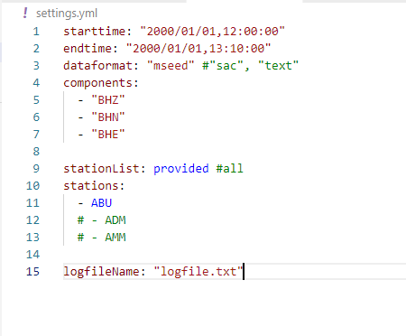

## Setup for using the program

- STEP 1: Install webdriver for successful execution of the Fnet script
  We recommend geckodriver for Firefox
  Installation page: https://github.com/mozilla/geckodriver/releases
  
  __NOTE__: You must have Firefox installed in your system

- STEP 2: add geckodriver location info to the system path (For Mac see ~/.bash_profile, for Linux see ~/.bashrc). For windows user, you can copy the `geckodriver.exe` file to your desired location and add that location to the system environment path.

- STEP 3: make [user account](https://hinetwww11.bosai.go.jp/nied/registration/?LANG=en)  and add the `user` and `passwd` to config.py file. Please make sure to confirm your registration.

- STEP 4: install the environment using the `environment.yml` file or `requirements.txt` file:

```
pip install -r requirements.txt
```

For conda environment:

```
conda create --name fnetdata --file requirements.txt
```


## Run script



- edit the `settings.yml` file to specify your desired data
- execute the script `fnet_data_download.py` for downloading the Fnet data

__NOTE__: the script need to be executed in proper environment.

```
python fnet_data_download.py
```

## Other necessary informations

- Data will be downloaded for all the stations listed in `F_net_stations.txt`.
- Download information can be accessed through the logfile.txt
- The data will be downloaded in the `downloadDir` folder

## NOTES (for FNET data):

- Be careful that 50MB is maximum size of one file that you can request.
- If you request one hour continuous waveform data of all observatories in SEED format with a sampling rate of 20Hz (e.g, BH\*), data file creation for download may take about 10 minutes.
- And if you request 12 hours continuous waveform data of all observatories in SEED format with a sampling rate of 1Hz (e.g, LH\*), data file creation for download may also take about 10 minutes.
- The latest data is from about two\* days ago.
